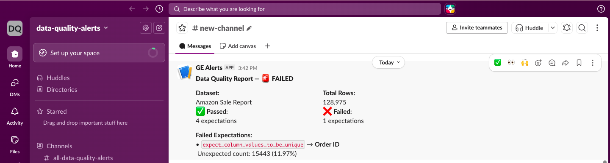
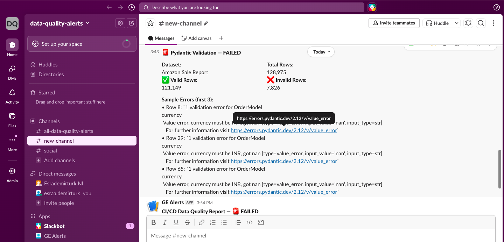
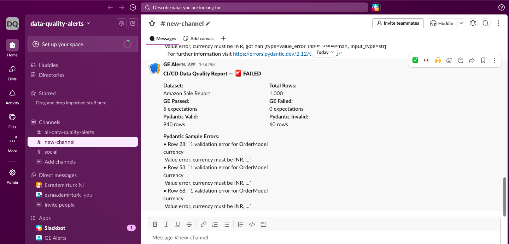

# 🔍 Data Quality Pipeline

An end-to-end data quality validation pipeline built with **Great Expectations**, **Pydantic**, and **GitHub Actions CI/CD**, with automated **Slack alerting** on failure.

---

## 🏗️ Architecture

```
Amazon Sale Report (CSV)
         ↓
┌─────────────────────────┐
│   Great Expectations    │  ← Table-level validation
│   (5 expectations)      │
└─────────────────────────┘
         ↓
┌─────────────────────────┐
│   Pydantic v2           │  ← Row-level validation
│   (6 rules per row)     │
└─────────────────────────┘
         ↓
  valid_rows.csv   invalid_rows.csv
         ↓
┌─────────────────────────┐
│   Slack Alert           │  ← Notification on failure
└─────────────────────────┘
         ↓
┌─────────────────────────┐
│   GitHub Actions CI/CD  │  ← Auto-triggered on every push
└─────────────────────────┘
```

---

## 📁 Project Structure

```
data-quality-pipeline/
├── data/
│   └── amazon_orders.csv
├── .github/
│   └── workflows/
│       └── dq_validation.yml
├── screenshots/
│   ├── slack_ge.png
│   ├── slack_pydantic.png
│   └── slack_cicd.png
├── dq_pipeline.py
├── requirements.txt
└── README.md
```

---

## ✅ Homework 1 — Great Expectations

Dataset-level validation using **Great Expectations Core v1.0+** in a fully code-first workflow (no CLI).

### Expectations Defined

| Rule | Column | Result |
|---|---|---|
| Must not be null | Order ID | ✅ PASSED |
| Must be unique | Order ID | ❌ FAILED |
| Must be >= 0 | Qty | ✅ PASSED |
| Must be >= 0 | Amount | ✅ PASSED |
| Must be in allowed set | Status | ✅ PASSED |

### Key Finding
`Order ID` uniqueness check failed — **15,443 duplicate IDs** found (11.97% of 128,975 rows). This indicates the same order appears across multiple rows, likely due to multi-item orders or multiple shipment statuses per order.

### Slack Alert — GE Validation


---

## ✅ Homework 2 — Pydantic Row-Level Validation

Row-by-row validation using **Pydantic v2** with strict field rules.

### Pydantic Model Rules

| Field | Rule |
|---|---|
| `order_id` | string, must not be empty |
| `qty` | integer, >= 0 |
| `amount` | float, >= 0 |
| `currency` | must be `"INR"` |
| `ship_country` | must be `"IN"` |
| `date` | must match format `%m-%d-%y` |

### Results

| | Count |
|---|---|
| Total Rows | 128,975 |
| ✅ Valid Rows | 121,149 (93.9%) |
| ❌ Invalid Rows | 7,826 (6.1%) |

### Key Finding
Invalid rows are primarily caused by `currency = NaN` — rows where both `Amount` and `currency` are missing, indicating incomplete order records. These are correctly separated into `invalid_rows.csv` for further investigation.

### Slack Alert — Pydantic Validation


---

## ✅ Homework 3 — GitHub Actions CI/CD

Automated data quality checks triggered on every `push` and `pull_request`.

### Workflow Steps

```
on: [push, pull_request, workflow_dispatch]

steps:
  1. Checkout repository
  2. Set up Python 3.11
  3. Install dependencies
  4. Run dq_pipeline.py
     → exit code 0  = CI green ✅
     → exit code 1  = CI red ❌ + Slack alert
```

### CI/CD Results (1,000 row sample)

| Check | Result |
|---|---|
| GE Expectations | 5/5 passed ✅ |
| Pydantic Valid Rows | 940 / 1,000 |
| Pydantic Invalid Rows | 60 / 1,000 |
| Overall CI Result | FAILED ❌ (invalid rows detected) |

### Slack Alert — CI/CD Pipeline


---

## 🔧 Tools & Technologies

| Tool | Purpose |
|---|---|
| Great Expectations v1.0+ | Table-level data validation |
| Pydantic v2 | Row-level schema validation |
| Pandas | Data loading & processing |
| GitHub Actions | CI/CD automation |
| Slack Webhooks | Failure alerting |

---

## 🚀 How to Run Locally

```
pip install -r requirements.txt
python dq_pipeline.py
```

---

## 📊 GE vs Pydantic

| | Great Expectations | Pydantic |
|---|---|---|
| **Level** | Table / dataset | Row / record |
| **Best for** | Statistical checks, big data | Strict schemas, configs |
| **Output** | Pass/Fail report | Valid/Invalid rows |
| **Integration** | Spark, Fabric, Airflow | APIs, pipelines |
